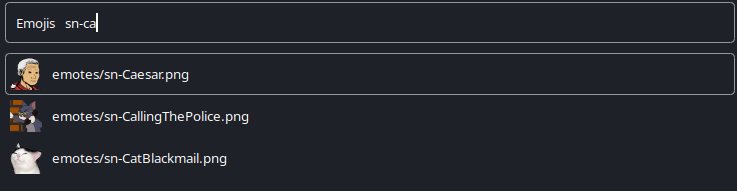

# rofi-emoji-picker

A simple emoji picker powered by [rofi](https://github.com/davatorium/rofi).

Most applications have custom emoji boards and, in some cases, require you to pay in order to use their full features (e.g. Discord Nitro). This script allows you to use a custom emoji set regardless of the application.



## How does it work?

Suppose you have organized your emoji collection into a file structure inside the `emotes` folder.
Launching the picker will spawn a rofi window like in the image above, allowing you to search through the emoji names to find the one you want.
Once selected, the URL of the emoji will be copied to your clipboard, allowing you to paste it in the application of your choosing.
This will, for most chat applications, inline the image, appearing as if you had sent an emoji.

Benefits:
- cross-application emojis (no more coordination between different applications)
- no need to pay for custom emoji support
- works even for applications that do not have emoji support
- no limits on the amount of emojis
- can be used for gifs, stickers, and all kinds of links/reactions, not just emojis

## Setup

You will need a static website to host the images. This can be your own host, or, as in the rest of this guide, GitHub pages.

GitHug pages setup steps:
1. Prepare a GitHub repository with support for static GitHub pages (no Jekyll).
    1. Optional: Add a custom domain, e.g., `cdn.mydomain.com`
2. Structure the repository as follows:
```
.
├── emojis      // your emojis
├── gifs        // your gifs
├── stickers    // your stickers
└── ...         // additional files you might want to add
```
3. Add `rofi-emoji-picker` as a submodule:
```bash
$ git submodule add https://github.com/ivan-ristovic/rofi-emoji-picker _picker
```
4. Execute the `update-list` script - this will generate the `list.txt` file will all your content. This wll be used by rofi when presenting the option list.
5. Launch the picker:
```bash
$ ./_picker/launch "my.github.pages.domain" <custom_rofi_options>
```
6. Pick an emoji and verify that the URL is copied to your clipboard.
7. You can now keybind the script (i3 example below).

### i3 keybinding

Add to i3 config:
```bash
bindsym $mod+p exec <my-i3-script-dir>/emoji-picker
``` 

Contents of `emoji-picker`:
```bash
emoji_picker_dir='/path/to/my/github/emojis/repo'
cd "$emoji_picker_dir" && \
    ./_picker/launch "https://my-github-emojis-repo.github.io"
```

Example of my `emoji-picker` keybinding target:
```bash
emoji_picker_dir='/opt/rofi-emoji-picker-custom/'
cd "$emoji_picker_dir" && \
    ./_picker/launch "https://cdn.ristovic.net" -theme "$HOME/.config/rofi/launchers/type-3/style-5.rasi"
```

## Adding new emojis

New content can be added using `store` script. Refer to the script for details.

After adding new content, run the `update-list` script to regenerate `list.txt`.
